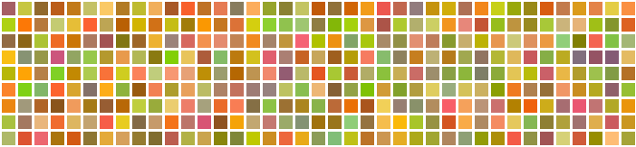
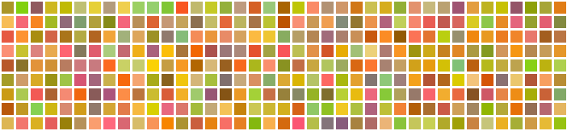
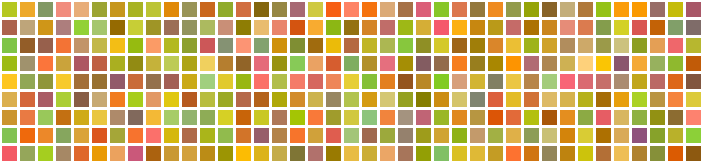

+++
title = "First steps with Azure Functions"
description = ""
date = 2017-04-17
slug = "first-steps-with-azure-functions"
+++

At the end of last year I decided to take a look at Azure Functions. I really like the serverless concept so I set myself a simple task to build a function that returned an image of random multicoloured squares.



## What did I learn?
* On the whole I really like Azure Functions. I'm not a massive fan of the Azure portal but I think the Azure Function blade is good enough.
* There's a few seconds delay from a cold start of the function (you can change the plan to enable the function to be always on).
* Ways of generating an aesthetically pleasing colour palette.

## What next?
* I've only touched the surface of hat Azure Functions can offer. I'd like to look into different triggers, Azure Functions proxies and much more.
* I want to look at AWS lambda as a comparison
* What's the best way of deploying functions?
* Good ways of writing tests around functions?
* Visual studio but preferably vscode integration



## The code
Here's the code in full, I wrote it in the Azure Functions editor itself, it's quick and dirty :)


```cs
#r "System.Drawing"

using System.Drawing;  
using System.Drawing.Drawing2D;  
using System.Drawing.Imaging;  
using System.Net;  
using System.Net.Http.Headers;

public static HttpResponseMessage Run(HttpRequestMessage req, TraceWriter log, int width, int height)  
{
    Func<Bitmap,byte[]> draw = (bitmap) => {
        var rectangles = CreateRectangles(width, height);
        return DrawRectanglesOnImage(rectangles, bitmap);
    };

    byte[] image = CreateImage(width, height, draw);

    return CreateResponse(image);
}

private static byte[] CreateImage(int imageWidth, int imageHeight, Func<Bitmap,byte[]> draw)  
{
    using (var image = new Bitmap(imageWidth, imageHeight))
    {
        return draw(image);
    }
}

private static byte[] DrawRectanglesOnImage(IEnumerable<Rectangle> rectangles, Bitmap image)  
{
    var mixColour = Color.Orange;
    var backgroundColour = Color.White;

    var pen = new Pen(backgroundColour, 1.7F);
    pen.Alignment = PenAlignment.Inset;

    using (var graphics = Graphics.FromImage(image))
    using (var ms = new MemoryStream())
    {
        var random = new Random();
        foreach(var rectangle in rectangles)
        {
            int red = (random.Next(0, 255) + mixColour.R) / 2;
            int green = (random.Next(0, 255) + mixColour.G) / 2;
            int blue = (random.Next(0, 255)+ mixColour.B) / 2;

            var colour = Color.FromArgb(red, green, blue);
            var brush = new SolidBrush(colour);
            graphics.FillRectangle(brush, rectangle);
            graphics.DrawRectangle(pen, rectangle);
        }

        image.Save(ms, ImageFormat.Png);

        return ms.ToArray();
    }
}

private static IEnumerable<Rectangle> CreateRectangles(int imageWidth, int imageHeight)  
{
    const int width = 18;
    const int height = 18;
    var columns = imageWidth / width;
    var rows = imageHeight / height;
    int x = 0;
    int y = 0;

    for(var row = 0; row<=rows; row++)
    {
        for(var column = 0; column<=columns; column++)
        {
            yield return CreateRectangle(x, y, width, height);
            x += width;
        }
        x = 0;
        y += height;
    }
}

private static Rectangle CreateRectangle(int x, int y, int width, int height)  
{
    return new Rectangle(x, y, width, height);
}

private static HttpResponseMessage CreateResponse(byte[] image)  
{
    var response = new HttpResponseMessage(HttpStatusCode.OK);
    response.Content = new ByteArrayContent(image);
    response.Content.Headers.ContentType = new MediaTypeHeaderValue("image/png");
    response.Content.Headers.ContentLength = image.Length;

    return response;

```

